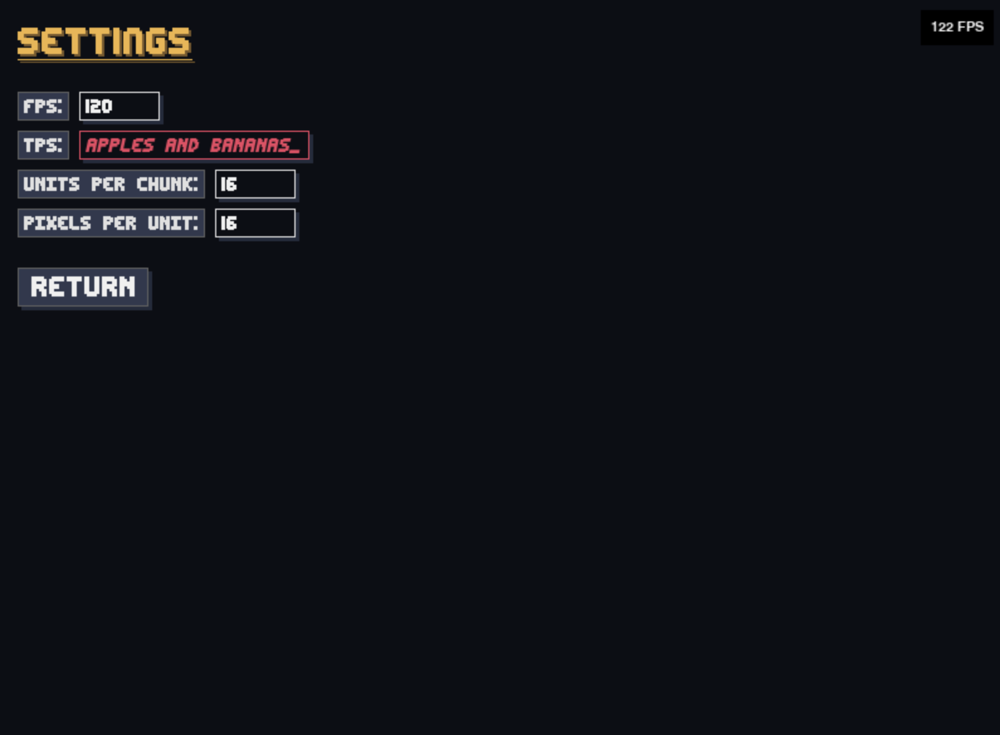

# Pygame Interface #

A small UI toolkit for pygame-ce games that provides menu and element primitives.

*Please note, this code is an incomplete repository with code from my ongoing project Mountain of Tiles. Of importance is that I have excluded the renderer, and for that I am very sorry.*

Please, check back in for future updates or reach out to me directly with questions.



## Description

The project packages common menu widgets and layout helpers so game code can focus on behavior instead of boilerplate UI. Element classes in [elements.py](elements.py) cover styling, layout, text, and imagery. Menu definitions in [types.py](types.py) compose those elements into full screens, and [manager.py](manager.py) exposes a push/pop stack for swapping menus during gameplay. Shared tuning constants live in [config.py](config.py) and flow into the auto-built Settings menu.

## Installation

1. Install Python 3.11+.
2. Install dependencies:

    ```bash
    pip install -r requirements.text
    ```

3. Ensure pygame-ce can open a window on your platform (SDL prerequisites on Linux; macOS is ready out of the box).

## Usage

Define your menu actions, register menus, and drive the stack during the game loop.

```python
from manager import menu_manager
from types import Start, Pause

def start_game():
	print("Starting...")

def resume_game():
	print("Resuming...")

# Create menus
start_menu = Start(on_start=start_game, on_quit=quit)
pause_menu = Pause(on_resume=resume_game, on_exit=quit)

# Register and show the start menu
menu_manager.add_menu(start_menu)
menu_manager.add_menu(pause_menu)
menu_manager.push_stack(Start)

# Later, when pausing
menu_manager.push_stack(Pause)

# Handling selection
selected = menu_manager.top().get_selected_element()
if selected:
	print("Currently focused element", selected.id)
```

The `Settings` menu auto-generates editable fields for each uppercase value in [config.py](config.py); value changes are applied live via its validators and actions. Customize or subclass the provided menus to match your game’s branding, and compose new menus by building `Element` trees.

## Features

- Stack-based menu manager with push/pop semantics
- Rich UI element set: text, buttons, images, divisions, gaps, shadows, borders
- Built-in menus: Start, Pause, Settings (auto-wires `config` values), About
- Selection helpers for keyboard/controller navigation
- Configurable layout metrics (absolute/relative sizing, padding, gap, justify/alignment)
